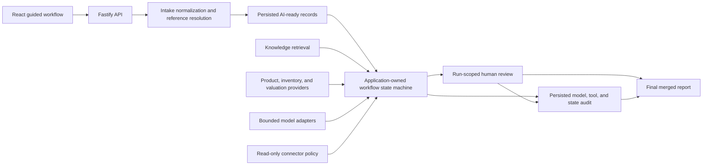

# SwingOps AI

SwingOps AI is a guided golf retail workflow demo for turning messy trade-in intake into normalized, reviewable, AI-ready operational records.

The main product experience is the **Guided Workflow**. It walks through messy source intake, normalized record creation, guarded workflow execution, human validation, review corrections, audit data, and a final run report.

## What the app demonstrates

SwingOps AI shows how an AI-assisted operational workflow can be structured around safety, traceability, and human review instead of a single black-box model response.

The guided run demonstrates:

- Messy multi-source intake from free text, poorly formed CSV, email-style text, and logs.
- Normalized AI-ready records with schema fields, missing-field signals, and review status.
- A deterministic workflow state machine with persisted transitions, validation gates, retry traces, and evidence.
- Bounded model assistance that can advise on selected field repairs but cannot control workflow state, tools, writes, or review decisions.
- Retrieval grounding through a local knowledge base and weighted RAG-style matching.
- Internal inventory matching and trade-in valuation evidence.
- Model routing and provider fallback logging.
- MCP-compatible read-only tool execution with policy checks.
- Human validation and review through a run-scoped review queue.
- Structured review corrections that persist improved records and learning events.
- Audit trails across workflow runs, model calls, tool calls, review items, and final output.
- Deterministic workflow and retrieval evaluations that protect expected behavior.

## Guided Workflow

The Guided Workflow is the default app view.

It starts with an overview/setup page and then walks through five actionable steps:

1. **Messy Source Intake**
   Add one or more messy source inputs, choose source types, paste or upload text, and normalize the sources.

2. **AI-Ready Records**
   Inspect the normalized records created from intake. The app shows extracted fields, missing fields, review flags, and persisted AI-ready records.

3. **Guarded Workflow Execution**
   Run the trade-in workflow using the normalized input. Application code advances a fixed state sequence, retrieves knowledge matches, checks inventory, estimates valuation ranges, invokes safe read-only tools, and blocks unsafe mutation behavior. Model calls are limited to advisory field repair in two bounded states.

4. **Validation Review**
   Inspect record-level review issues and run-level checks. Resolve review queue items with controlled corrections when human judgment is needed.

5. **Final Run Report**
   Review the final merged output, readiness status, audit trace, review changes, learning events, and records ready for downstream use.

For a deeper walkthrough, see [Guided Workflow](docs/guided-workflow.md).

## Architecture at a glance

The browser talks only to the API. Application code owns workflow transitions,
validation, tool selection, writes, and review status. Models receive selected
records and evidence for narrow advisory tasks; their responses are
schema-validated and cannot directly advance the workflow or mutate records.

## Design choices and tradeoffs

| Choice                                                   | Why it fits this workflow                                                                                               | Tradeoff and production evolution                                                                                            |
| -------------------------------------------------------- | ----------------------------------------------------------------------------------------------------------------------- | ---------------------------------------------------------------------------------------------------------------------------- |
| Application-controlled state machine                     | Makes ordering, retries, terminal status, and transition authority inspectable.                                         | Less open-ended than model planning; new workflow branches require explicit code and tests.                                  |
| Advisory model boundary                                  | Allows useful repairs and comparisons without giving a provider authority over tools or records.                        | Some tasks need human review even when a model could make a plausible guess.                                                 |
| Deterministic local defaults                             | Keeps setup, tests, and the complete demonstration repeatable without secrets or external availability.                 | Live-provider quality and latency still require separate acceptance checks with configured credentials.                      |
| Bounded product-reference provider                       | Parsers receive structured evidence and search a limited candidate set instead of owning aliases or scanning a catalog. | The local provider uses indexed demo data; production can implement the same contract with SQL, vector, or hybrid search.    |
| Deterministic retrieval with pgvector-compatible storage | Exposes citations, weighted scoring, and degradation behavior while keeping local results stable.                       | Production retrieval would use managed ingestion, production embeddings, representative corpora, and larger evaluation sets. |
| Read-only MCP-compatible execution                       | Demonstrates tool discovery and policy enforcement without allowing uncontrolled operational changes.                   | Production mutations need identity, authorization, approval, idempotency, and service-specific controls.                     |
| Persisted human-review signals                           | Preserves the approved change and its evidence for audit and later improvement.                                         | Learning events are not automatically training data or an automated retraining pipeline.                                     |

## Demo and production boundaries

| Capability                   | Implemented here                                                                                                                                | Production evolution                                                                                                          |
| ---------------------------- | ----------------------------------------------------------------------------------------------------------------------------------------------- | ----------------------------------------------------------------------------------------------------------------------------- |
| Workflow reliability         | Persisted transition guards, schema validation, bounded retries, provider deadlines, transactional completion, and idempotent failure handling. | Add durable workers, queueing, distributed tracing, service-level objectives, and operational alerting.                       |
| Model routing                | Provider adapters, selection, fallback, attempt logs, cost metadata, and deterministic mock behavior.                                           | Configure approved providers and credentials, then add provider-specific monitoring, rate limits, and live acceptance checks. |
| Product and business systems | Replaceable product-reference, inventory, and valuation interfaces backed by deterministic local data.                                          | Connect the interfaces to governed catalog, inventory, pricing, and transaction systems.                                      |
| Knowledge retrieval          | Seeded documents, deterministic embeddings, pgvector search, weighted ranking, citations, and retrieval evaluations.                            | Add production ingestion, access-aware retrieval, corpus monitoring, and representative offline and online evaluations.       |
| Tool integration             | A real local MCP stdio transport over one policy-controlled connector registry; low-risk reads execute and mutations are blocked.               | Add authenticated remote transport, tenant-aware authorization, approval workflows, and audited mutation executors.           |
| Data protection              | Audit-boundary redaction and prompt-injection indicators for synthetic or approved local data.                                                  | Add a reviewed data inventory, tenant isolation, retention and deletion controls, managed keys, DLP, and compliance review.   |

## Main systems involved

- **Web app**: React and TypeScript guided workflow UI.
- **API**: Fastify and TypeScript backend routes, workflows, services, and serializers.
- **Database**: PostgreSQL accessed through Prisma.
- **Knowledge/RAG**: Local deterministic retrieval over seeded trade-in knowledge chunks, with pgvector-compatible storage.
- **Workflow runs**: Persisted execution records with steps, status, model logs, tool logs, and review items.
- **AI-ready records**: Persisted normalized intake records with source metadata, quality signals, and RAG readiness.
- **Review queue**: Human-in-the-loop queue for incomplete, ambiguous, or low-confidence records.
- **MCP-compatible tools**: Internal connector surface with read-only execution policy and audit logging.
- **Inventory and valuation systems**: Simulated internal systems used to demonstrate matching and valuation evidence.

## Tech stack

- pnpm workspaces
- TypeScript
- React + Vite
- Fastify
- Prisma
- PostgreSQL
- pgvector-compatible knowledge storage
- Zod
- Vitest
- Playwright
- MCP SDK

## Quick start

Install dependencies:

    pnpm install

Create the API environment file from the checked-in local defaults:

    cp services/api/.env.example services/api/.env
    pnpm config:check

Start PostgreSQL:

    pnpm db:up

Prepare Prisma locally:

    pnpm --filter @swingops/api prisma:generate
    pnpm --filter @swingops/api prisma:migrate

Start the API and web app together:

    pnpm dev

Or run them separately:

    pnpm --filter @swingops/api dev
    pnpm --filter @swingops/web dev

Open the web app using the URL printed by Vite. The default product experience is **Guided Workflow**.

## Five-minute reviewer walkthrough

After starting the app:

1. Continue to **Messy Source Intake**, select **Load golden demonstration**, and normalize the four staged sources.
2. In **AI-Ready Records**, compare normalized fields with missing-field and review signals. Notice that structure does not imply approval.
3. Run **Guarded Workflow Execution** and inspect the persisted state sequence, citations, inventory and valuation evidence, model boundary, read-only tool call, and blocked mutation. Enable the provider-outage option only when you want to exercise the explicit fallback path.
4. In **Validation Review**, apply only corrections supported by prior review or verified evidence. Leave ambiguous or insufficiently supported records unresolved.
5. In **Final Run Report**, confirm that final values, unresolved records, corrections, learning events, provider attempts, and tool-policy evidence agree.

A clean local setup displays deterministic `MOCK` model assistance. To perform a
separate live-provider acceptance check, configure a supported provider and
explicitly enable real model calls as described below. The complete expected
record-level outcomes are documented in
[Golden demonstration run](docs/guided-workflow.md#golden-demonstration-run).

## Environment assumptions

Environment files are workspace-local so the API, Prisma, and Vite use their
native loading behavior:

- Node.js and pnpm. CI uses Node.js 22 and the package-manager version declared in `package.json`.
- Docker for the local PostgreSQL service.
- `services/api/.env`, copied from `services/api/.env.example`, for the API and Prisma.
- `apps/web/.env` only when overriding the web app's default `http://localhost:4000` API URL; use `apps/web/.env.example` as the template.
- Prisma migrations applied to the local database before running the full workflow.

API tests never use the development database. The test command creates and
resets the guarded `_test` database configured by `TEST_DATABASE_URL` before the
API suite starts.

The default experience uses deterministic/mock model behavior and does not
require a provider key. Real model calls are opt-in through
`ENABLE_REAL_MODEL_CALLS` and the provider variables documented in the API
example file. Provider attempts and the complete provider fallback sequence are
bounded by the deadline settings in that file. Step 3 of the guided workflow
also includes a deterministic provider-fallback demonstration that exercises
the normal adapter, classification, audit, and fallback path without making an
external request.

Useful database commands:

    pnpm db:up
    pnpm db:logs
    pnpm db:down

## Demo knowledge base

The guided workflow can retrieve richer grounding evidence when demo knowledge has been ingested.

Run the app, open the connector/knowledge controls in the UI, and use the demo knowledge ingestion action. The backend route behind that action is:

    POST /knowledge/ingest-demo

The knowledge system stores local deterministic embeddings and weighted scoring metadata for trade-in policy, club reference, condition, brand alias, and shaft flex guide chunks.

## Validation commands

### Reliability and evaluations

The reliability story is enforced at several levels:

- Workflow transition guards reject invalid ordering and duplicate entry.
- Provider attempt and workflow deadlines bound fallback execution.
- Transactional completion keeps the final step, run, and intake batch aligned.
- Idempotent failure handling preserves the first terminal cause and completed evidence.
- Workflow evaluation scenarios protect against invented values, missing source evidence, unnecessary review, and automatic application of prior-review suggestions.
- Knowledge evaluations protect expected retrieval type, rank, evidence, and degradation behavior.
- The Playwright suite exercises the complete five-step product journey against an isolated `_test` database.

With the API running, the evaluation surfaces are:

    GET  /workflow-evals/scenarios
    POST /workflow-evals/run
    POST /knowledge/evals/run

Run code, stylesheet, and formatting checks:

    pnpm lint

Apply the repository formatter:

    pnpm format

Run typechecks:

    pnpm --filter @swingops/web typecheck
    pnpm --filter @swingops/api typecheck

Run all workspace typechecks:

    pnpm -r typecheck

Run tests:

    pnpm --filter @swingops/web test
    pnpm --filter @swingops/api test

Run all tests:

    pnpm -r test

Install the browser used by the end-to-end suite, then run the deterministic
five-step demonstration against the guarded test database:

    pnpm test:e2e:install
    pnpm test:e2e

The browser suite starts isolated API and web servers, forces deterministic
model behavior, and refuses to use a database whose name does not end in
`_test`.

## Repository structure

    apps/web
      React guided workflow UI, review queue UI, API clients, hooks, types, and styles.

    services/api
      Fastify API, workflow orchestration, route handlers, serializers, Prisma access,
      knowledge retrieval, model routing, tool policy, internal inventory, valuation,
      and MCP-compatible connector execution.

    docs
      Deeper documentation for architecture, workflow behavior, backend systems,
      data models, development, testing, and AI workflow concepts.

## Documentation

- [Architecture](docs/architecture.md)
- [Guided Workflow](docs/guided-workflow.md)
- [Backend Systems](docs/backend-systems.md)
- [Data Models](docs/data-models.md)
- [Data Handling Boundaries](docs/data-handling.md)
- [AI Workflow Concepts](docs/ai-workflow-concepts.md)
- [Development](docs/development.md)
- [Testing](docs/testing.md)

## Local MCP server

SwingOps AI includes a local stdio MCP server transport for development:

    pnpm --filter @swingops/api mcp:dev

The MCP transport wraps the existing API-owned connector surface. It does not define a second tool registry.

Current behavior:

- `tools/list` exposes the existing SwingOps tool contracts.
- `tools/call` delegates to the same MCP-compatible tool call adapter used by the API.
- Allowed low-risk read-only tools execute through the read-only executor.
- Disabled or mutation-oriented tools remain visible for governance but are blocked before execution.
- Successful, failed, and blocked calls persist `ToolCallLog` records.

This local transport does not claim hosted deployment, tenant isolation, production OAuth, or remote MCP access.

See [Development](docs/development.md#local-mcp-server) for copy-pasteable local
client configuration and the focused transport test command.
