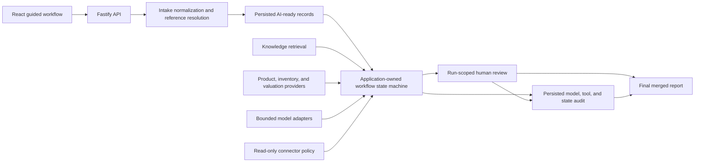

# Architecture

SwingOps AI is a local full-stack workflow demo built around a guided operational run. The application is split into a web app, an API service, and a PostgreSQL database.

The architecture emphasizes:

- Deterministic, persisted workflow state.
- Traceable model and tool activity.
- Read-only connector execution.
- Human review before uncertain records are treated as final.
- Persisted normalized records that can be inspected after the run.

## System boundary map

The API is the authority boundary. The UI requests actions and renders returned
state, while application code owns workflow transitions, validation gates, tool
selection, persistence, and review status. Models and internal services provide
bounded evidence to that application-owned process.

## Design decisions and tradeoffs

### Deterministic orchestration over model planning

The workflow uses a fixed, persisted state machine because ordering, retries,
failure status, and transition ownership must be reconstructable from stored
evidence. This is less open-ended than allowing a model to plan arbitrary next
steps, and adding a workflow branch requires explicit implementation and tests.
That constraint is intentional for an operational process where unsupported
writes or skipped validation would be more costly than reduced autonomy.

### Advisory model work over model authority

The model sees only application-selected records and evidence for two bounded
repair tasks. Schema validation and application policy decide what happens next.
This produces more human-review work than automatically accepting plausible
model output, but it keeps state transitions, tools, writes, and final approval
under deterministic control.

### Local determinism with replaceable provider boundaries

Model behavior, product-reference data, inventory, valuation, knowledge
documents, and embeddings all have deterministic local implementations. That
makes setup and regression testing repeatable. Their contracts are separated
from parsing and orchestration so production implementations can use remote
model providers, catalog SQL, hybrid retrieval, or internal service APIs without
moving aliases, ranking, or operational authority back into the workflow.

The local implementations do not prove production scale, provider availability,
or corpus quality. Those require representative data, live-provider acceptance,
capacity testing, service-level objectives, and production monitoring.

### Read-only tool execution over broad tool access

The tool registry exposes both allowed and blocked capabilities so discovery,
risk metadata, policy, and audit behavior are visible. Only supported low-risk
reads execute. Production mutations would require authenticated identities,
tenant-aware authorization, approval rules, idempotency, and service-specific
executors before the policy could safely allow them.

### Persisted learning signals over automatic retraining

Human review creates structured learning events that preserve the field,
evidence, proposed value, approved value, and confidence impact. They are useful
for audit and future evaluation or training-data curation. The application does
not automatically retrain or change extraction behavior from a saved event;
promotion into a model, rule, or reference-data update remains a governed step.

### Synchronous local execution over distributed workers

The demonstration runs workflows synchronously through one API service and a
local PostgreSQL database. This keeps the full execution trace easy to run and
inspect. Larger workloads would move long-running work behind durable queues and
workers, add concurrency and idempotency controls at service boundaries, and use
distributed tracing and operational alerting while preserving the same run,
step, provider, tool, and review ownership model.

## Workspace layout

    apps/web
    services/api
    docs

## `apps/web`

The web app is a React and TypeScript Vite application.

Primary responsibilities:

- Render the Guided Workflow.
- Collect messy source input.
- Call backend workflow routes.
- Display normalized AI-ready records.
- Display guarded workflow evidence.
- Surface validation and review queue work.
- Submit structured review corrections.
- Display the final run report.

Important areas:

    apps/web/src/App.tsx
    apps/web/src/components/guided-demo
    apps/web/src/components/guided-demo/source-intake
    apps/web/src/components/guided-demo/steps
    apps/web/src/components/guided-demo/steps/validation-review
    apps/web/src/components/guided-demo/steps/final-run-report
    apps/web/src/components/review-queue
    apps/web/src/hooks
    apps/web/src/types
    apps/web/src/api
    apps/web/src/utils

`App.tsx` keeps the Guided Workflow as the primary view and wires workflow state, review queue state, and the current guided step into `GuidedDemoPathPage`.

## `services/api`

The API is a Fastify and TypeScript service.

Primary responsibilities:

- Register HTTP routes.
- Execute demo workflows.
- Persist workflow run state.
- Persist AI-ready records.
- Persist review queue items and review corrections.
- Search the knowledge base.
- Route model tasks through provider selection and fallback logic.
- Execute read-only tools behind policy checks.
- Serialize database records into UI-safe responses.

Important areas:

    services/api/src/app.ts
    services/api/src/server.ts
    services/api/src/routes
    services/api/src/workflows
    services/api/src/knowledge
    services/api/src/ai
    services/api/src/tools
    services/api/src/internal-systems
    services/api/src/serializers
    services/api/prisma/schema.prisma

## PostgreSQL, Prisma, and pgvector-compatible storage

The local database is PostgreSQL, accessed through Prisma.

The database stores:

- Intake batches and intake items.
- Workflow runs and workflow steps.
- Model call logs and model provider attempt logs.
- Tool call logs.
- Review queue items.
- Reviewed trade-in records.
- Human review learning events.
- AI-ready intake records.
- Knowledge documents, chunks, and ingestion runs.

Knowledge chunks include embedding metadata and pgvector-compatible vector storage. The local retrieval implementation uses deterministic embeddings and weighted scoring so the app can demonstrate grounding behavior without depending on a remote embedding service.

## Workflow runs

A `WorkflowRun` is the top-level audit container for a guarded execution.

It connects:

- The intake batch or intake item being processed.
- Ordered workflow steps.
- Model call logs.
- Tool call logs.
- Review queue items.
- AI-ready intake records.
- Reviewed trade-in records.
- Human review learning events.

The UI uses workflow run data to show status, evidence, audit traces, and final readiness.

## Workflow orchestration

The guarded trade-in workflow is implemented as an application-controlled state
machine. Its eight persisted states have a fixed order. The persistence helper
enforces that the run is active, every earlier state is completed or intentionally
skipped, and the current state is still pending before execution begins. Completion
and retry transitions are also status-guarded so a state cannot be entered twice or
moved through an invalid transition.

Two states allow bounded model assistance: field-repair advice and one targeted
field retry. Application code selects the records, evidence, and retry target;
validates the returned schema; and retains authority over state transitions, tools,
persistence, mutation policy, and human review. The API returns an orchestration
trace that makes these boundaries and persisted state outcomes visible to the UI.

## Review queue

The review queue captures records that should not be silently accepted.

A review item can represent:

- Missing required fields.
- Low-confidence extraction.
- Ambiguous input.
- Validation failure.
- Manual review routing.

The guided review step filters the review queue to the current run and lets a reviewer resolve records through a controlled correction flow.

## AI-ready records

An AI-ready intake record is a normalized, persisted source-derived record. It includes:

- Source type and source name.
- Raw source text and cleaned text.
- Normalized JSON.
- Inferred schema JSON.
- Metadata JSON.
- Quality signals JSON.
- Review-needed status.
- Embedding readiness.
- RAG readiness.

AI-ready does not mean automatically approved. It means the record has enough structure, source context, and quality metadata to be safely used by later workflow steps or reviewed before downstream use.

## Knowledge and RAG

The knowledge system stores local demo knowledge as documents and chunks.

The search flow supports:

- Brand and category filtering.
- Chunk type filtering.
- Weighted score breakdowns.
- Matched terms.
- Scoring explanations.
- Citations back to source document metadata.

The retrieval mode is deterministic for local development. It demonstrates the shape of retrieval grounding while keeping local runs repeatable.

## Model routing

The model routing layer demonstrates how model work can be selected and logged based on provider, model, cost, latency, quality, and health behavior.

The workflow logs model call attempts so a reviewer can see:

- Which provider/model was selected.
- Which goal the model call served.
- Whether fallback behavior occurred.
- Cost and latency metadata.
- Attempt outcomes.

Routing selects a provider for an application-defined advisory task. It does not
give the provider authority to plan the workflow or change execution state.

## MCP-compatible tools

The tool layer exposes internal tool contracts through an MCP-compatible surface.

Key design points:

- Tool definitions are grouped by domain.
- Tools include risk metadata.
- Read-only tools can execute through the read-only executor.
- Mutation tools can remain visible for planning and governance but are blocked without approval.
- All allowed, blocked, and failed calls can be audited through `ToolCallLog`.

The local stdio MCP server wraps the same connector surface used by the API. It is intentionally thin so there is one source of truth for tool contracts and policy.

## Inventory and valuation internal systems

The app includes simulated internal systems for:

- Inventory product matching.
- Similar product lookup.
- Trade-in valuation range estimation.
- Valuation adjustment explanation.

These systems are local services, but they are architected like internal read-only operational systems. The guarded workflow uses them as evidence sources instead of treating model output as the only source of truth.

## Audit logging

Auditability is built into the persisted data model.

A completed guided run can produce:

- Workflow run status.
- Ordered workflow step output.
- Model call logs and provider attempts.
- Tool call logs.
- Knowledge matches and score explanations.
- Inventory match evidence.
- Valuation range evidence.
- Review queue items.
- Reviewed trade-in records.
- Human review learning events.
- Final merged record readiness.

Run finalization is transactional. Failure handling is also transactional and
idempotent: the first failure becomes the terminal run record, active child work
is closed, future steps are skipped, and completed evidence remains unchanged.

The final report pulls these pieces together so a reviewer can understand what happened, what changed, and what is ready for later use.
